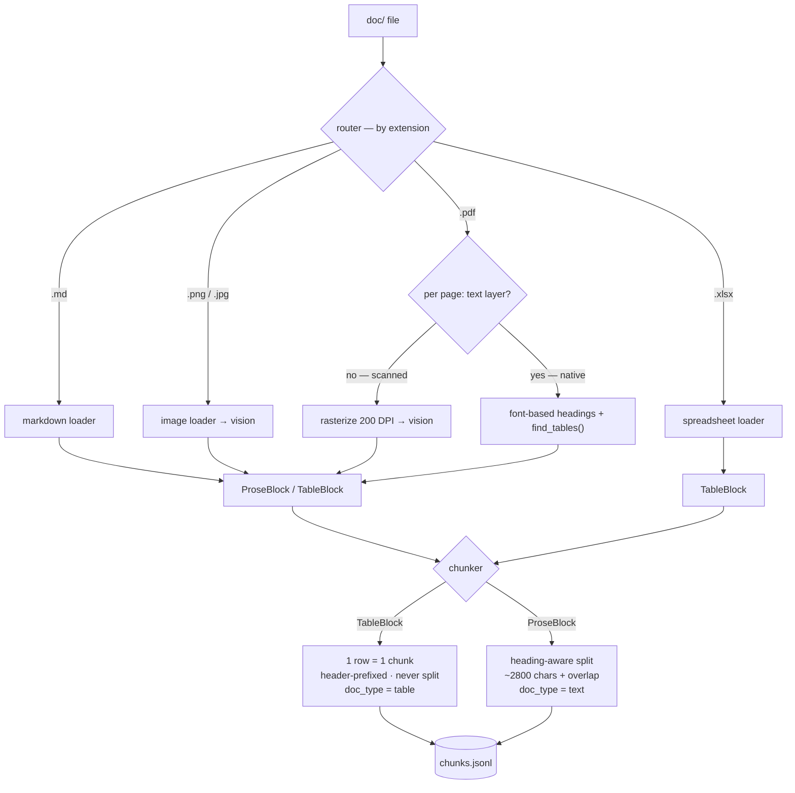

# DECISIONS — Design & Rationale

Design and rationale document for the Aura AI Assistant RAG case study, structured
per Section 2 of the brief.

---

## Step 1 summary — what was built

A standalone ingestion pipeline that turns the 8 raw corpus files in `doc/` into a
single, structure-preserving, tagged **chunk list** (`data/chunks.jsonl`). This step
deliberately stops **before** embedding so it can be developed and tested on its own;
embedding/indexing is Step 2 and consumes this JSONL.

Layout (`backend/ingestion/`): `schema.py` (the `Chunk` contract + JSONL I/O),
`router.py` (extension → loader), `loaders/{markdown,pdf,image,spreadsheet}.py`,
`vision.py` (provider-agnostic image→Markdown with on-disk cache), `chunker.py`
(heading-aware prose splitter + table→row builder + shared Markdown parser),
`run.py` (CLI), `verify.py` (automated sanity checks).

Run and verify:

```bash
.venv/bin/python -m backend.ingestion.run    --doc-dir doc --out data/chunks.jsonl
.venv/bin/python -m backend.ingestion.verify --in  data/chunks.jsonl
```

Result: **151 chunks across all 8 documents**, all hard checks passing. Verified
facts: 04 error codes E‑101…E‑500 each a separate row-chunk with its resolution;
02 subscription plans (Free/Plus/Pro); 03 LED indicators → all 7 colour rows;
05 scanned spec sheet → full spec table (processor, 1 GB RAM / 8 GB storage,
110×110×32 mm, wireless radios, etc.); 07 FAQ → 25 question sections preserved;
08 embedded privacy table → 16 row-chunks.

---

## 1. Decision rationale (Karar gerekçeleri)

### 1.1 Ingestion architecture — router + content-typed loaders, one shared `Chunk`

A thin **router** dispatches by file extension to a per-type loader; every loader
returns the same `Chunk` dataclass (`text`, `source_doc`, `doc_type`, `modality`,
`page`, `section`, `metadata`, deterministic `chunk_id`). Fixing this contract up
front keeps loaders independent and the output uniform.

**Key refinement — route PDFs by content, not by extension.** Both native and
scanned documents are `.pdf`, so extension cannot tell them apart. The single PDF
loader probes each page's extractable text and decides per page: text layer →
parse natively; negligible text → rasterize and send to vision. This was grounded
in measurement, not assumption: native pages yield 1.4k–9.5k characters
(02/06/07/08) while the scanned page (05) yields **0**. The per-page decision also
generalizes to mixed/hybrid PDFs and to documents we have not seen.

Alternatives considered and rejected:
- **One monolithic parser.** Couples unrelated concerns; impossible to test or
  tune per type.
- **Extension-only routing** (separate `text_pdf`/`scanned_pdf` loaders). Cannot be
  selected by extension; the discriminator is the text layer, not the filename.
- **A single "convert everything to plaintext" library.** Destroys structure — see
  §2.

### 1.2 Chunking strategy

- **Tables → one row per chunk, header-prefixed, never split.** Each row is rendered
  as self-contained `Column: value` lines (with the section/table title), so a
  retrieved row carries its own meaning (e.g. an error-code row keeps code, meaning,
  cause, and resolution together). Splitting a row would break that integrity.
- **Prose → heading-aware split.** Text is segmented at section boundaries first;
  each section is packed to a character budget (~2,800 chars ≈ 500–800 tokens) at
  paragraph boundaries, with a small tail overlap for retrieval continuity. Sizing
  uses characters, not `tiktoken` — it is the wrong tokenizer for our generation
  model and would pull an external dependency into a step we keep API-free for the
  text path. Exact token accounting is deferred to embedding time.
- **Heading detection uses font metadata, not regex.** PyMuPDF span sizes/bold
  flags identify headings robustly: the body size is computed per document (it
  varies — 9.0pt in 06/08, 10.0pt in 07) and a line is a heading when it is
  meaningfully larger or bold-and-larger. This catches both numbered headings
  (`1. Genel Bakış`) and the unnumbered FAQ question headings in 07, which a
  `^\d+\.` regex would miss, while excluding the non-heading document-metadata line.

Rejected: fixed-size sliding windows (cut across tables and section boundaries),
whole-document chunks (too coarse for citation), one-sentence chunks (too fine,
loses context).

**Chunking strategy — visual.** How each document type becomes blocks, and how the
chunker turns blocks into chunks:



Worked example of the two strategies:

```text
TABLE — 04_hata_kodlari.xlsx  (header + 6 rows)
   ┌ Hata Kodu │ Anlamı │ Olası Neden │ Önerilen Çözüm   ← header
   │ E-101 …                                            ┐
   │ E-205 …                                            │ each row → 1 chunk
   │ …                                                  │ (header-prefixed,
   │ E-500 …                                            ┘  never split)
   → 6 chunks (doc_type = table)

   one chunk (E-205):
     Hata Kodları
     Hata Kodu: E-205
     Anlamı: Hub aşırı ısındı
     Olası Neden: Yetersiz havalandırma…
     Önerilen Çözüm: Cihazı kapatıp 15 dk soğumaya bırakın…

PROSE — 02 § "Abonelik Planları"  (~1450 chars, ≤ budget)
   ## Abonelik Planları
   Aura Home üç plan sunar: Ücretsiz (Free)… Plus… Pro…
   → 1 chunk (doc_type = text, section = "Abonelik Planları")
   if a section > ~2800 chars → split at paragraph boundaries, ~10–15% overlap
```

### 1.3 Visual & tabular extraction (required by the brief)

Some corpus information exists **only** in an image or a scanned page (03 LED
indicators, 05 technical specs) and is repeated nowhere in plain text, so extracting
it with structure intact is mandatory.

**Decision: transcribe images to structured Markdown with a multimodal LLM, then
chunk that Markdown through the same table/prose path** — not classical OCR.
Tesseract-style OCR returns a flat character stream: it loses the row/column
structure of tables and, critically for the LED card, the *colour → meaning*
relationship (the colour is conveyed visually, not as text), and it handles Turkish
table layouts poorly. A vision LLM transcribes directly into a Markdown table with
each colour described in words, which then flows through the normal "table → one
row per chunk" path.

- **Scanned PDF (05):** the page is rasterized at 200 DPI and sent as an image, so
  there is a single uniform vision path for both scanned pages and standalone
  images.
- **Provider is pluggable.** `vision.py` supports Claude (default,
  `claude-opus-4-8`) and Gemini, selected by `.env`. The default reflects the
  original choice; the provider can switch without touching the pipeline.
- **What this run used:** no Anthropic credential was available in the environment
  (and could not be borrowed from the editor connection), so this run used **Gemini
  `gemini-2.5-flash`**. `gemini-2.5-pro` was unavailable on the project's free tier
  (quota 0); flash is more than capable for table/figure transcription. Output is
  **cached** to `backend/ingestion/.cache/`, so re-runs are free and deterministic
  and do not depend on a live key.
- **Evidence it worked:** the LED image produced all 7 colour rows with textual
  colour descriptions; the scanned spec sheet produced the complete specification
  table.

### 1.4 Embedding model, vector store, generation model (Step 2)

**Embedding model — OpenAI `text-embedding-3-small` (1536 dims, cosine).**
The corpus is Turkish, so the deciding criterion is multilingual quality. This
model's multilingual coverage is adequate for the baseline, it is the cheapest
tier (~$0.02 / 1M tokens), and it keeps the provider surface small. Embedding is
isolated behind a single `embed(texts)` function (`backend/embedding/client.py`)
used by **both** indexing and query time — a hard requirement, since documents
and queries must be embedded by the same model to share a vector space; it also
makes the provider swappable in one file (validating the on-prem story in §7).
Requests are **batched** (100 inputs/call) because the corpus produces hundreds
of chunks and per-item calls would be slow and costly.

- *Why not Claude:* **Anthropic has no embedding model** — it was never a real
  option; Anthropic points to third parties for embeddings.
- *Rejected alternatives:* **Cohere `embed-multilingual-v3`** (1024 dims,
  retrieval-tuned, arguably stronger Turkish) — viable, but adds a third provider
  for a marginal baseline gain. **Open-source BGE-M3 / multilingual-e5** (1024
  dims, self-hosted) — deferred; documented as the **on-prem / air-gapped swap**
  the `embed()` abstraction enables (§7), and BGE-M3's native sparse vectors would
  also feed the Step-3 hybrid search.

**Vector store — Qdrant (cosine).** Runs as a container in `docker-compose.yml`,
so the whole system still comes up with one command and the backend connects by
service name. The collection vector size is pinned to the embedding model's
dimensionality (read from the embedding module so the two never drift). Each
chunk becomes one point whose **payload carries the full chunk metadata**
(`source_doc`, `doc_type`, `modality`, `page`, `section`, the text) — needed
downstream for **citations** and **filtering**. Point IDs are
`uuid5(namespace, chunk_id)`: deterministic, so re-indexing overwrites in place
rather than duplicating (idempotent). Qdrant ships a built-in web UI
(`:6333/dashboard`) for inspecting collections and running searches.

- *Rejected alternatives:* **Chroma / FAISS** — lighter, but FAISS is a library
  (no service, no payload filtering out of the box) and Chroma's filtering/ops
  story is weaker; Qdrant gives a first-class container, metadata filtering, and a
  hybrid/sparse path we'll use in Step 3.

**Generation model — OpenAI `gpt-4o-mini` (Step 3a).** The target was originally
pinned to Claude `claude-opus-4-8` (strongest grounded-answer / abstention
behavior), but the Step-3a baseline was wired to **OpenAI `gpt-4o-mini`**: since
embedding already runs on OpenAI (`text-embedding-3-small`), generation reuses the
same provider/key surface — one `.env` variable, no extra provider setup.
Generation is isolated behind a single-file `generate(question, hits)` function
(`backend/generation/client.py`), exactly like `embed()`; switching to Claude (or
an on-prem open-weight model, §7) is a one-file change behind that boundary
(`GENERATION_MODEL` env override + the provider SDK if needed). Answers are
generated at `temperature=0`; the system prompt forces the model to rely only on
the provided context, cite its sources, and abstain when the context is insufficient.

**Abstention — a single retrieval-score rule.** Not a second LLM call: if the best
hit's cosine similarity is below `ABSTENTION_THRESHOLD` (default 0.38, env-tunable),
nothing relevant is in the corpus, the model is never called, and the system returns
the fixed *"I couldn't find this in the knowledge base."* response. Because the
corpus is small and closed, this is the critical piece that stops fabrication on
out-of-corpus questions. The 0.38 default was calibrated on this corpus: relevant
queries score 0.40–0.64 and out-of-corpus queries 0.29–0.34 — a clean gap that 0.38
separates correctly. As a second safety net, questions that clear the gate but still
have thin context are abstained independently by the grounded prompt in `generate()`.
Orchestration (`embed → search → abstain → generate`) lives in `backend/pipeline.py`,
separate from HTTP, so it is testable without bringing up the server (and later by
the eval harness); `backend/api.py` is only the FastAPI shell (`POST /query`).

**What this step deliberately does *not* do.** Retrieval here is the **naive
dense-only baseline** — single-vector cosine similarity. The brief's required
"at least one quality improvement" (hybrid search + reranking) is Step 3, built
on top of this baseline so its lift can be measured against it.

**Verified (red-LED test).** Querying *"internet bağlantısı yok"* returns the LED
row "sabit kırmızı = internet yok" from doc 03 — a fact that exists **only** in an
image. That single query proves embedding, indexing, and Step-1's vision
extraction are all working and that image-only content is now searchable.

**Step 3b — Hybrid retrieval (dense + sparse/BM25, RRF fusion).** Dense cosine
similarity captures meaning but is weak on tokens that must match *verbatim* —
error codes (`E-102`), specs (`5V/2A`), protocol versions (`Zigbee 3.0`). So each
point now also carries a **sparse BM25 vector** alongside the dense one, and
retrieval runs in two selectable modes (`retrieval_mode="dense"` baseline vs
`"hybrid"`), so Step 4's eval can measure the lift. Measured on the 45-question
golden set, hybrid beats the dense baseline on every retrieval metric — most
visibly **MRR 0.81 → 0.90** (the correct source is ranked higher), confirming the
verbatim-token rationale above. Full numbers in the [Evaluation](#evaluation-step-4) section.

- *Why RRF for fusion:* dense (cosine, 0–1) and sparse (BM25) scores live on
  different, incomparable scales. Reciprocal Rank Fusion combines the two by
  **rank**, not raw score, so there is no score normalization to tune — Qdrant
  supports it natively (`FusionQuery(Fusion.RRF)` over two `prefetch` arms).
- *Why a custom BM25 tokenizer (not fastembed):* avoids a heavy dependency
  (onnxruntime) and a first-use model download, keeps tests fully hermetic, and
  gives full control over tokenization so the exact-match tokens above survive
  intact (the regex keeps `-`/`/`/`.` connectors inside a token). Token→index
  uses a stable `blake2b` hash, never Python's salted builtin `hash()`, so a
  document and a query encoded in different processes still map a token to the
  same index. **IDF is computed server-side** by Qdrant's sparse `Modifier.IDF`,
  so it always reflects the current collection and never needs recomputing.
- *Abstention stays a dense cosine gate.* The `0.38` threshold was calibrated on
  cosine scores; hybrid hits carry RRF scores on a different scale. So hybrid
  changes only the *ranking* handed to generation, while the abstain/answer
  decision still rests on the dense top-1 similarity (one extra cheap local
  probe). Adding the sparse vector changed the collection schema, so
  `ensure_collection` drops a leftover dense-only collection and rebuilds it.

---

## 2. Ingesting different file types (Farklı dosya türlerinin içeri alınması)

**Why the naive "flatten everything to plain text" approach is insufficient.**
Flattening collapses a table into a run of words, destroying the column/row
relationship and the header→cell mapping. An error-code row becomes detached
fragments; a spec sheet loses which value belongs to which field; an image's
information disappears entirely. Because some corpus facts live *only* in tables and
images, naive flattening would make those questions unanswerable — exactly the
failure the brief calls out.

**Approach per file type — context preserved at ingestion time:**

| Type | Loader | How structure/context is preserved |
|---|---|---|
| Markdown (01) | `markdown` | Split on `#`/`##` headings; each chunk tagged with its section. |
| Native PDF (02, 06, 07, 08) | `pdf` (text path) | Font-based heading detection sets `section`; `find_tables()` extracts embedded tables structurally (kept separate from prose, row-per-chunk). |
| Scanned PDF (05) | `pdf` (vision path) | Page rasterized → LLM transcribed to a Markdown table → row-per-chunk. |
| Image (03) | `image` | LLM transcription preserving the colour→meaning table. |
| Spreadsheet (04) | `spreadsheet` | One row per chunk; header names prefixed to every cell value so each row is self-contained. |

Each chunk carries `source_doc`, `page`, `section`, and `modality`
(`markdown`/`pdf_text`/`pdf_scanned`/`image`/`spreadsheet`), so downstream
retrieval/citation knows where every piece of context came from and how it was
extracted. Table rows additionally carry `metadata.key` (e.g. the error code) and
the column list.

---

## 3. Failure modes observed at the ingestion stage (Step 1)

The brief asks for the top failure modes across the whole system; below are the ones
specific to ingestion, with the mitigations already in place. The system-wide top‑3
(retrieval/generation/freshness) are in §8.

- **Vision omission/hallucination on tables** — a multimodal model may drop or
  invent rows. *Mitigation:* a transcription prompt that forbids omitting/merging
  rows; `verify.py` asserts expected content (e.g. all 6 error codes, LED row count)
  and the cached Markdown is human-inspectable before it ever reaches embedding.
- **Scanned-vs-native misclassification** — a near-empty native page could be
  mistaken for scanned (or vice-versa). *Mitigation:* a low character threshold with
  per-page decisioning; thresholds are explicit and adjustable.
- **Table mis-detection in native PDFs** — `find_tables()` could miss a borderless
  table, letting it fall back to prose. *Mitigation:* `verify.py` reports table-row
  counts per document (e.g. 08 → 16 rows) so a regression is visible.

---

## Evaluation (Step 4)

A single-command harness (`python -m eval.run`) scores the 45-question golden set
(`eval/golden_set.jsonl`: 40 answerable, 5 out-of-corpus) with no external eval
framework. It measures four things, **dense vs hybrid side by side** — the
comparison that justifies the Step 3b hybrid decision with numbers.

| Metric | Dense (baseline) | Hybrid |
|---|---|---|
| Recall@3 | 0.93 | **0.97** |
| Recall@5 | 0.95 | **0.97** |
| MRR | 0.81 | **0.90** |
| Faithfulness | 0.96 | **0.99** |
| Answer relevance | 0.91 | **0.92** |
| Abstention recall | 5/5 | 5/5 |
| False abstentions | 3/40 | 3/40 |

**Why each metric.**

- *Retrieval (Recall@k, MRR — LLM-free, deterministic).* For each answerable
  question we drive `embed()` + `search()` directly (bypassing generation, so
  this half is free) and check the returned `source_doc`s against the golden
  `expected_sources`. A hit is *any* expected source present (multi-hop questions
  list several; surfacing one counts). Hybrid wins on every retrieval metric, led
  by **MRR 0.81 → 0.90**: BM25 pulls verbatim-token chunks (error codes, specs) up
  the ranking that dense cosine ranked lower.
- *Generation (LLM-as-judge).* Each answer is scored 1–5 (normalised to 0–1) on
  faithfulness (grounded in retrieved context, no fabrication) and answer
  relevance (does it address the question). Both are already high on the dense
  baseline (0.96 / 0.91) and edge up with hybrid (0.99 / 0.92): better-ranked
  context leaves slightly less room to drift, while the grounding prompt keeps
  even the baseline faithful.
- *Abstention (corpus-specific).* The brief requires refusing rather than guessing
  when the corpus can't answer. All 5 out-of-corpus probes are correctly refused
  in both modes. Notably the **dense score gate (0.38) does not catch them** —
  they retrieve semantically-near chunks scoring 0.55–0.64 — the **grounded
  generation prompt** does, emitting the fixed abstention message. The metric
  counts a refusal as *gate-abstain OR abstention-message*, so it measures the
  two-layer defense as users experience it. *False abstentions* are the opposite
  failure: answerable questions wrongly refused (3/40 in both modes) — a ~7% over-
  refusal rate, the main quality gap left and the first thing to tune (threshold /
  prompt) next.

**Judge ≠ generator, to limit self-bias.** Generation runs on `gpt-4o-mini`; the
judge runs on the stronger, separate `gpt-4o` (`EVAL_JUDGE_MODEL`). Same provider,
different capability — this reduces but does not eliminate self-bias (both are
OpenAI); a fully independent judge (e.g. Gemini, already wired for vision) would
remove it. Judge calls use `temperature=0` and return strict JSON.

**Reproduce.** `python -m eval.run` (full); `--retrieval-only` for the free,
deterministic retrieval table; `--no-judge` to skip judge calls. Results, run
config (models, threshold, top-k, timestamp) and per-question detail are written
to `eval/results.json`. Metric arithmetic is unit-tested LLM-free in
`tests/test_eval_metrics.py`.

---

## 4. Assumptions & notes (Kısıtlar / Varsayımlar)

- The corpus is **Turkish**; transcription preserves the original language verbatim.
- **Single tenant** for the implementation (multi-tenancy is a Section-2 design
  topic, not coded — per the brief).
- For the cloud path, sending images to a hosted multimodal LLM is acceptable; the
  on-prem/air-gapped variant (open-weight VLM) is a Section-2 topic, below.
- Vision transcripts are cached on disk; committing the cache would let an evaluator
  reproduce ingestion **without** a vision API key (a packaging option for the final
  submission).
- Character-based chunk sizing is a deliberate Step‑1 simplification; token-exact
  budgeting can be revisited at embedding time.

---

## 5. Frontend & Docker packaging (Step 5)

A single static page (`frontend/`, vanilla HTML/CSS/JS) served by the backend
itself at `:4242` — no separate container. It has five tabs: a **chat** view
(question in, grounded answer + source cards showing `source_doc`/`section`/
`modality`/score, with a dense/hybrid toggle), a **metrics** view (renders
`eval/results.json` as the dense-vs-hybrid table), a static **architecture**
diagram, a **prompt-flow** trace that shows the live pipeline per query
(embed → search → scores → abstention decision → generation), and a **decisions**
view that renders this document (TR/EN) in the UI. The required minimum (ask, see
answer, see citations) is the chat tab; the others make the system
self-explanatory for the evaluator. The UI also offers a light/dark theme toggle,
defaulting to **light (white)**.

The API stays thin: `POST /query`, `GET /metrics` (serves the results file),
`GET /health` (Docker healthcheck), `GET /decisions/{lang}` (this doc), and the
static UI at `/`. `docker-compose.yml`
brings up two services — **Qdrant** and the **backend** — with one
`docker compose up`. On start the backend **auto-indexes the prebuilt
`data/chunks.jsonl`** if the collection is empty (`backend/entrypoint.sh`), so the
evaluator does not re-run the costly vision step: ingestion output is committed,
only embedding + upsert run at boot, and that needs the OpenAI key from `.env`.

---

## 6. Production migration plan (Production'a taşıma planı)

### 6.1 Multi-tenancy & tenant isolation

The implementation is single-tenant (per the brief); for production each customer
is a tenant whose data must never leak into another's answer. Isolation is
**defense-in-depth**, not a single filter:

- **Storage.** Default to a **Qdrant collection (or named partition) per tenant**
  — a query physically cannot reach another tenant's vectors. For very large or
  regulated customers, a dedicated instance/database (full physical isolation).
  Shared-collection + `tenant_id` payload filter is the cheap alternative but
  rejected as the default: isolation then rests on never forgetting the filter,
  one bug leaks data.
- **Identity.** `tenant_id` is derived from the authenticated token, **never** from
  the request body or a client-supplied parameter (avoids the IDOR class of bug).
- **Query.** The tenant scope is mandatory; there is no "unfiltered search" code
  path. A missing scope errors rather than searching everything.
- **Generation.** Only the tenant's own chunks enter the prompt, and retrieved
  text is fenced as data, not instructions (see §6.5, prompt injection).
- **Side channels.** `tenant_id` is part of every cache key, log scope, and eval/
  metric bucket — the usual quiet leak paths (a shared answer cache, a common log
  sink) are scoped too.

### 6.2 Index freshness (add / update / delete)

The corpus changes daily. The deterministic `chunk_id` → `uuid5` point ID already
makes re-ingesting a document **idempotent** (same chunk overwrites in place). On
top of that:

- **Add/update:** re-ingest the changed document and upsert; unchanged points are
  untouched. A content hash per source document skips work when nothing changed.
- **Delete:** the hard case for RAG. Deleting a source must delete its points, or
  the system will cite content that no longer exists. Because every point carries
  `source_doc` in its payload, a delete is a filtered point-deletion by
  `source_doc` (+ `tenant_id`). Stale-citation-after-delete is an explicit failure
  mode (§8).
- **Re-embedding:** changing the embedding model invalidates the whole space, so
  that is a versioned, full re-index into a new collection with an atomic switch,
  not an in-place edit.

### 6.3 Latency & cost (target p95 < 2 s, ~100 qps; cost is critical)

Where time and money go per query, and how to hold the target:

- **The dominant latency and cost is generation**, not retrieval. Embedding the
  query and the Qdrant hybrid search are tens of milliseconds; the LLM call is
  hundreds of ms to seconds. So: keep `gpt-4o-mini`-class models for generation,
  cap the context (top-k = 5, not 20), and stream tokens so perceived latency
  drops.
- **Abstention saves the most expensive call**: out-of-corpus questions never
  reach the LLM, so junk traffic costs almost nothing.
- **Caching:** a semantic cache on (normalized question → answer) per tenant cuts
  both latency and cost for repeated questions — a support corpus has a heavy head
  of FAQ-like queries.
- **~100 qps** is met by horizontal scaling: the backend is stateless (all state is
  in Qdrant), so it scales out behind a load balancer; Qdrant scales with
  replication/sharding. The embedding/LLM providers are the real rate-limit and
  cost ceiling, which is the strongest pull toward the self-hosted models in §7.

### 6.4 Observability

Log per query (scoped by `tenant_id`, PII-redacted): retrieval scores and the
chosen `source_doc`s, the abstention decision and which layer fired (gate vs
prompt), generation latency and token counts, and total p50/p95. Track over time:
abstention rate (a spike means the corpus or threshold drifted), retrieval score
distribution, cost per query, and a sampled faithfulness score from the eval judge
run against production traffic. Alert on p95 breach, abstention-rate spikes, and
provider error rates.

### 6.5 Security

- **Indirect prompt injection.** A malicious document in the corpus could carry
  text like "ignore previous instructions." Retrieved content is fenced as
  untrusted data in the prompt (clearly delimited, labelled as reference material,
  never as instructions), the system prompt asserts it cannot be overridden by
  context, and ingestion can flag/scrub suspicious instruction-like spans.
- **PII.** Detect and redact PII at ingestion (so it never enters the vector
  store in the clear where possible), encrypt at rest and in transit (Qdrant +
  transport), scope every access by tenant, and honour deletion requests via the
  delete path in §6.2 (the corpus's own privacy policy, doc 08, requires this).
- **Tenant isolation** as in §6.1.

---

## 7. On-premise / air-gapped deployment (Bulut kullanmayan senaryo)

Some customers cannot send data to external APIs. The system is built so this is a
**configuration swap, not a rewrite**: generation, embedding, and vision each sit
behind a single function, so each provider is replaceable in one file.

- **Generation & embedding — open-weight, self-hosted.** Serve an open-weight LLM
  (e.g. a Llama-/Qwen-class instruct model) with **vLLM** for throughput, quantized
  (e.g. AWQ/GPTQ 4-bit) to fit commodity GPUs. Swap embedding to **BGE-M3** (the
  `embed()` abstraction already anticipates this; BGE-M3's native sparse vectors
  would also feed the existing hybrid path, removing the custom BM25 tokenizer).
  Vision swaps to an open-weight VLM (e.g. Qwen-VL) for the scanned/​image
  documents.
- **Vector store & the rest are already self-hostable.** Qdrant runs on-prem as-is;
  the whole stack is already containerized.
- **Hardware footprint.** The driver is the LLM: a quantized mid-size instruct
  model needs roughly one 24–48 GB GPU for low-concurrency support workloads;
  embedding/vision are far lighter and can share or run on CPU at low volume. This
  is the main new cost/ops burden (GPU procurement, model-update process,
  monitoring).
- **Trade-offs vs cloud.** Lower answer quality than frontier models, more ops and
  maintenance, manual model-update cycles — traded for full data residency and no
  per-token cost. For **air-gapped** installs, additionally: pre-download and
  vendor all model weights and images, no telemetry/auto-update, and an offline
  package/license channel.

---

## 8. System-wide top failure modes (Başlıca hata senaryoları)

The three most consequential failure modes for this support assistant, each with
detection and mitigation. Two are grounded in the measured eval results (§Eval).

1. **Over-refusal on hard-to-retrieve documents (false abstention).** Observed:
   3/40 answerable questions wrongly refused, all on the **scanned spec sheet**
   (q22/q23/q25), whose vision-transcribed chunks score lower in cosine than
   native text, so the 0.38 gate eats them. *Detect:* monitor abstention rate by
   `modality`; a high refusal rate on `pdf_scanned`/`image` is the signal.
   *Mitigate:* a per-modality (or learned) threshold rather than one global 0.38;
   the grounded prompt as the real arbiter while the gate only blocks clearly-empty
   retrievals.
2. **Retrieval miss → wrong-but-confident or abstained answer.** Observed: q23
   ("processor?") retrieves nothing relevant in either mode (recall 0) even though
   the fact exists in doc 05. *Detect:* low top-k scores logged per query;
   golden-set regression in CI. *Mitigate:* the hybrid search already lifts
   verbatim-token recall; next is better scanned-table chunking and query
   expansion (§9).
3. **Stale citation after a source changes/deletes.** In production a deleted or
   edited document can still be cited until the index catches up, directly hurting
   the trust the brief centers on. *Detect:* reconcile point `source_doc`s against
   the live document set; alert on orphans. *Mitigate:* the idempotent upsert +
   filtered-delete-by-`source_doc` freshness path in §6.2, run on every source
   change.

(LLM-judge unreliability is a fourth, eval-specific caveat: the judge twice marked
correct answers wrong by applying outside-world knowledge — e.g. reading "E-500" as
HTTP 500. It affects measurement, not the served system, and argues for a fully
independent judge.)

---

## 9. Improvement priority (İyileştirme önceliği)

With more time, the first thing to fix is the **abstention threshold / scanned-
document retrieval**, because it is the only measured quality gap (~7% over-refusal,
concentrated entirely on doc 05) and it hits the brief's core value: a support
assistant that refuses answerable questions erodes trust as much as one that
hallucinates. Concretely: make the abstention gate per-modality or calibrated on a
larger sample, improve the scanned-table chunking so spec rows embed more
distinctly, and add light query expansion so a question like "processor?" reaches
the "Çift çekirdekli 1.2 GHz" row. This is higher-leverage than adding a reranker,
which the eval shows is unnecessary given hybrid's already-strong ranking.

---

## 10. When RAG is not the right tool (RAG'in uygun olmadığı senaryo)

RAG is the right choice **here**: a per-tenant, frequently-changing, citation-
requiring knowledge base — fine-tuning can't cite and goes stale on daily updates,
and a single tenant's corpus is small. But:

- **Long-context** would beat RAG if a tenant's entire corpus reliably fit in the
  model's context window (this one is tiny — 151 chunks). Then stuffing all
  documents and skipping retrieval is simpler and avoids retrieval misses like q23
  — at the cost of per-query tokens that don't scale to large or many-tenant
  corpora, which is why RAG remains the default.
- **Keyword search** alone suffices if queries are exact-token lookups (error
  codes) with no paraphrase — but the corpus is conversational Turkish, so semantic
  matching is needed, hence hybrid rather than pure BM25.
- **Fine-tuning** fits stable, high-volume domain style/format, not a volatile
  factual KB that must cite sources.
- **Agentic / tool-calling** is the better fit when answers require actions or live
  data ("reset my hub", "what's my current plan") rather than document lookup — a
  natural extension once the KB-answer core is solid.
