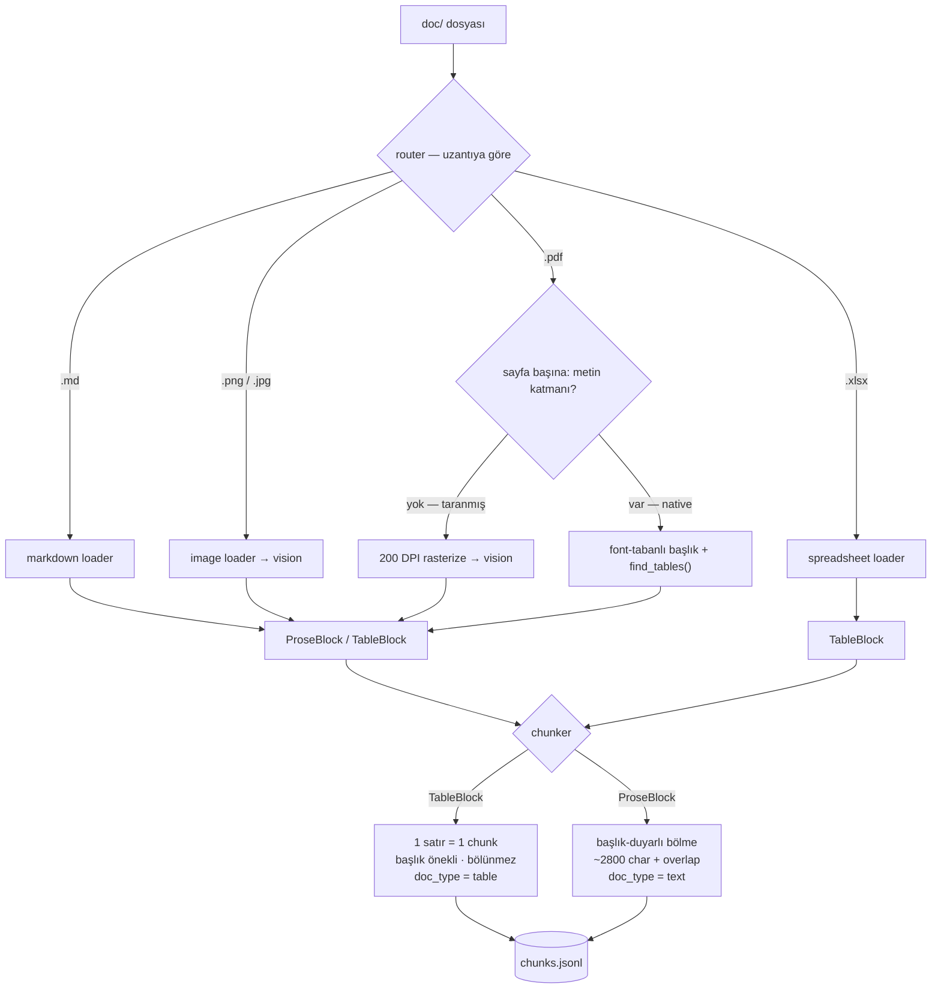

# DECISIONS — Tasarım & Gerekçe

Aura AI Assistant RAG vaka çalışması için tasarım ve gerekçe dökümanı; brief'in
2. Bölümü'nün yapısına göre düzenlenmiştir.

---

## Adım 1 özeti — ne yapıldı

`doc/` içindeki 8 ham korpus dosyasını tek bir, yapısı korunmuş, etiketli **chunk
listesine** (`data/chunks.jsonl`) çeviren, tek başına çalışan bir ingestion pipeline'ı.
Bu adım, kendi başına geliştirilip test edilebilsin diye bilinçli olarak embedding'den
**önce** durur; embedding/indeksleme Adım 2'dir ve bu JSONL'i girdi olarak kullanır.

Yerleşim (`backend/ingestion/`): `schema.py` (`Chunk` sözleşmesi + JSONL I/O),
`router.py` (uzantı → loader), `loaders/{markdown,pdf,image,spreadsheet}.py`,
`vision.py` (sağlayıcı-bağımsız, disk cache'li görsel→Markdown), `chunker.py`
(başlık-duyarlı prose bölücü + tablo→satır üreteci + ortak Markdown ayrıştırıcı),
`run.py` (CLI), `verify.py` (otomatik sağlık kontrolleri).

Çalıştırma ve doğrulama:

```bash
.venv/bin/python -m backend.ingestion.run    --doc-dir doc --out data/chunks.jsonl
.venv/bin/python -m backend.ingestion.verify --in  data/chunks.jsonl
```

Sonuç: **8 dokümanda toplam 151 chunk**, tüm "hard" kontroller geçti. Doğrulanan
gerçekler: 04 hata kodları E‑101…E‑500'ün her biri kendi çözümüyle ayrı satır-chunk;
02 abonelik planları (Free/Plus/Pro); 03 LED göstergeleri → 7 renk satırının tümü;
05 taranmış teknik özellik sayfası → tam özellik tablosu (işlemci, 1 GB RAM / 8 GB
depolama, 110×110×32 mm, kablosuz radyolar, vb.); 07 FAQ → 25 soru bölümü korundu;
08 gömülü gizlilik tablosu → 16 satır-chunk.

---

## 1. Karar gerekçeleri

### 1.1 Ingestion mimarisi — router + içerik-tipli loader'lar, tek ortak `Chunk`

İnce bir **router**, dosya uzantısına göre tür-bazlı bir loader'a yönlendirir; her
loader aynı `Chunk` dataclass'ını döndürür (`text`, `source_doc`, `doc_type`,
`modality`, `page`, `section`, `metadata`, deterministik `chunk_id`). Bu sözleşmeyi
en baştan sabitlemek, loader'ları bağımsız ve çıktıyı tek tip tutar.

**Önemli iyileştirme — PDF'i uzantıyla değil içerikle yönlendir.** Hem native hem de
taranmış dökümanlar `.pdf`'tir, dolayısıyla uzantı bunları ayırt edemez. Tek PDF
loader'ı her sayfanın çıkarılabilir metnini ölçer ve sayfa-bazında karar verir: metin
katmanı varsa → native ayrıştır; metin yok denecek kadar azsa → rasterize edip
vision'a gönder. Bu karar tahmine değil ölçüme dayanır: native sayfalar 1.4k–9.5k
karakter verir (02/06/07/08), taranmış sayfa (05) ise **0** verir. Sayfa-bazlı karar
ayrıca karışık/melez PDF'lere ve görmediğimiz dökümanlara da genellenir.

Değerlendirilip elenen alternatifler:
- **Tek dev ayrıştırıcı.** İlgisiz sorumlulukları birbirine bağlar; tür bazında test
  edilemez/ayarlanamaz.
- **Yalnızca uzantı ile yönlendirme** (ayrı `text_pdf`/`scanned_pdf` loader'ları).
  Uzantıyla seçilemez; ayraç dosya adı değil metin katmanıdır.
- **Tek bir "her şeyi düz metne çevir" kütüphanesi.** Yapıyı bozar — bkz. §2.

### 1.2 Chunking stratejisi

- **Tablolar → satır başına bir chunk, başlık önekli, asla bölünmez.** Her satır,
  kendi kendine yeterli `Sütun: değer` satırları olarak (bölüm/tablo başlığıyla)
  oluşturulur; böylece getirilen bir satır kendi anlamını taşır (ör. bir hata-kodu
  satırı; kod, anlam, neden ve çözümü birlikte tutar). Satırı bölmek bu bütünlüğü
  bozardı.
- **Prose → başlık-duyarlı bölme.** Metin önce bölüm sınırlarında ayrılır; her bölüm
  paragraf sınırlarında bir karakter bütçesine (~2.800 char ≈ 500–800 token) doldurulur,
  retrieval sürekliliği için küçük bir kuyruk-overlap bırakılır. Boyutlandırma `tiktoken`
  değil karakter kullanır — bu, generation modelimiz için yanlış tokenizer'dır ve metin
  yolunu API'siz tuttuğumuz bu adıma harici bağımlılık sokardı. Tam token hesabı
  embedding zamanına ertelenir.
- **Başlık tespiti regex değil font metadata kullanır.** PyMuPDF span boyutları/bold
  bayrakları başlıkları sağlam biçimde tespit eder: gövde boyutu doküman başına
  hesaplanır (değişir — 06/08'de 9.0pt, 07'de 10.0pt) ve bir satır anlamlı ölçüde büyük
  ya da bold-ve-büyük olduğunda başlıktır. Bu hem numaralı başlıkları (`1. Genel Bakış`)
  hem de 07'deki numarasız S&C soru başlıklarını yakalar — ki `^\d+\.` regex'i bunu
  kaçırırdı — ve başlık olmayan doküman-metadata satırını dışarıda bırakır.

Elenen: sabit-boy kayan pencere (tabloları ve bölüm sınırlarını keser), tüm-doküman tek
chunk (atıf için fazla kaba), cümle-başına chunk (fazla ince, bağlamı kaybeder).

**Chunking stratejisi — görsel.** Her doküman türü nasıl Block'lara dönüşüyor ve chunker
Block'ları nasıl chunk'a çeviriyor:



İki stratejinin somut örneği:

```text
TABLO — 04_hata_kodlari.xlsx  (başlık + 6 satır)
   ┌ Hata Kodu │ Anlamı │ Olası Neden │ Önerilen Çözüm   ← başlık
   │ E-101 …                                            ┐
   │ E-205 …                                            │ her satır → 1 chunk
   │ …                                                  │ (başlık önekli,
   │ E-500 …                                            ┘  bölünmez)
   → 6 chunk (doc_type = table)

   tek chunk (E-205):
     Hata Kodları
     Hata Kodu: E-205
     Anlamı: Hub aşırı ısındı
     Olası Neden: Yetersiz havalandırma…
     Önerilen Çözüm: Cihazı kapatıp 15 dk soğumaya bırakın…

PROSE — 02 § "Abonelik Planları"  (~1450 char, ≤ bütçe)
   ## Abonelik Planları
   Aura Home üç plan sunar: Ücretsiz (Free)… Plus… Pro…
   → 1 chunk (doc_type = text, section = "Abonelik Planları")
   bir bölüm > ~2800 char ise → paragraf sınırlarında bölünür, ~%10–15 overlap
```

### 1.3 Görsel & tablolu çıkarım (brief tarafından zorunlu)

Bazı korpus bilgileri **yalnızca** bir görselde veya taranmış sayfada bulunur (03 LED
göstergeleri, 05 teknik özellikler) ve hiçbir düz metinde tekrarlanmaz; dolayısıyla bu
bilgiyi yapısı bozulmadan çıkarmak zorunludur.

**Karar: görselleri, çok-modlu (multimodal) bir LLM ile yapılı Markdown'a transkribe et,
sonra bu Markdown'ı aynı tablo/prose yolundan geçir** — klasik OCR değil. Tesseract
tarzı OCR düz bir karakter akışı döndürür: tabloların satır/sütun yapısını ve — LED kartı
için kritik olan — *renk → anlam* ilişkisini kaybeder (renk metin olarak değil görsel
olarak verilir) ve Türkçe tablo düzenlerini kötü işler. Bir vision LLM, her rengi
kelimelerle tarif eden bir Markdown tablosuna doğrudan transkribe eder; bu da normal
"tablo → satır başına bir chunk" yolundan akar.

- **Taranmış PDF (05):** sayfa 200 DPI'da rasterize edilip görsel olarak gönderilir;
  böylece hem taranmış sayfalar hem de bağımsız görseller için tek tip bir vision yolu
  olur.
- **Sağlayıcı takılabilir.** `vision.py` Claude (varsayılan, `claude-opus-4-8`) ve
  Gemini'yi destekler, `.env` ile seçilir. Varsayılan, ilk tercihi yansıtır; sağlayıcı
  pipeline'a dokunmadan değiştirilebilir.
- **Bu çalışmanın kullandığı:** ortamda Anthropic kimlik bilgisi yoktu (ve editör
  bağlantısından ödünç alınamadı), bu yüzden bu çalışma **Gemini `gemini-2.5-flash`**
  kullandı. `gemini-2.5-pro` projenin ücretsiz katmanında kullanılamıyordu (kota 0);
  flash, tablo/figür transkripsiyonu için fazlasıyla yeterli. Çıktı
  `backend/ingestion/.cache/`'e **cache'lenir**, böylece tekrar çalıştırmalar ücretsiz ve
  deterministiktir, canlı bir anahtara bağlı değildir.
- **Çalıştığının kanıtı:** LED görseli, renkleri metinle tarif edilmiş 7 renk satırının
  tümünü üretti; taranmış özellik sayfası tam teknik özellik tablosunu üretti.

### 1.4 Embedding modeli, vektör deposu, generation modeli (Adım 2)

**Embedding modeli — OpenAI `text-embedding-3-small` (1536 boyut, cosine).**
Korpus Türkçe olduğundan belirleyici ölçüt çok dilli kalite. Bu modelin çok dilli
kapsamı baseline için yeterli, en ucuz katman (~$0.02 / 1M token) ve sağlayıcı
yüzeyini küçük tutuyor. Embedding tek bir `embed(texts)` fonksiyonunun
(`backend/embedding/client.py`) arkasında izole; bu fonksiyon **hem** indexing'de
**hem** sorgu zamanında kullanılıyor — zorunlu bir gereklilik, çünkü belgeler ve
sorgular aynı vektör uzayını paylaşmak için aynı modelle embed edilmeli; ayrıca
sağlayıcıyı tek dosyada değiştirilebilir kılıyor (§7'deki on-prem senaryosunu
doğruluyor). İstekler **batch** yapılıyor (çağrı başına 100 input), çünkü korpus
yüzlerce chunk üretiyor ve teker teker çağrı yavaş ve pahalı olurdu.

- *Neden Claude değil:* **Anthropic'in embedding modeli yok** — hiç gerçek bir
  seçenek değildi; Anthropic embedding için üçüncü taraflara yönlendiriyor.
- *Elenen alternatifler:* **Cohere `embed-multilingual-v3`** (1024 boyut,
  retrieval'a göre ayarlı, Türkçe'de muhtemelen daha güçlü) — uygulanabilir, ancak
  marjinal baseline kazanımı için üçüncü bir sağlayıcı ekliyor. **Open-source
  BGE-M3 / multilingual-e5** (1024 boyut, self-hosted) — ertelendi; `embed()`
  soyutlamasının olanak verdiği **on-prem / air-gapped geçiş** olarak belgelendi
  (§7), ayrıca BGE-M3'ün doğal sparse vektörleri Adım 3 hybrid search'i de
  besleyebilir.

**Vektör deposu — Qdrant (cosine).** `docker-compose.yml` içinde container olarak
çalışıyor; böylece tüm sistem hâlâ tek komutla ayağa kalkıyor ve backend servise
servis adıyla bağlanıyor. Collection vektör boyutu embedding modelinin boyutuna
sabitlendi (embedding modülünden okunuyor, böylece ikisi birbirinden sapmıyor).
Her chunk, payload'ında **tüm chunk metadata'sını** (`source_doc`, `doc_type`,
`modality`, `page`, `section`, metin) taşıyan tek bir point oluyor — bu downstream
retrieval'da **citation** ve **filtreleme** için gerekli. Point ID'leri
`uuid5(namespace, chunk_id)`: deterministik, böylece yeniden indexleme tekrar
oluşturmak yerine yerinde günceller (idempotent). Qdrant'ın gömülü bir web UI'ı
var (`:6333/dashboard`) — collection'ları incelemek ve arama yapmak için.

- *Elenen alternatifler:* **Chroma / FAISS** — daha hafif, ama FAISS bir kütüphane
  (servis yok, hazır payload filtreleme yok) ve Chroma'nın filtreleme/ops tarafı
  daha zayıf; Qdrant birinci sınıf bir container, metadata filtreleme ve Adım 3'te
  kullanacağımız hybrid/sparse yolu sunuyor.

**Generation modeli — şimdilik OpenAI `gpt-4o-mini` (Adım 3a).** Başta hedef
Claude `claude-opus-4-8` olarak kilitlenmişti (en güçlü grounded-cevap /
abstention davranışı), ancak Adım 3a baseline'ı **OpenAI `gpt-4o-mini`** ile
bağlandı: embedding zaten OpenAI (`text-embedding-3-small`) olduğundan generation
de aynı sağlayıcı/anahtar yüzeyini kullanıyor — tek bir `.env` değişkeni, ek bir
sağlayıcı kurulumu yok. Generation, `embed()` gibi tek dosyalık bir
`generate(question, hits)` fonksiyonunun (`backend/generation/client.py`)
arkasında izole; Claude'a (veya §7'deki on-prem açık-ağırlıklı bir modele) geçiş
bu sınırın ardında tek dosyalık bir değişiklik (`GENERATION_MODEL` env override'ı
+ gerekirse sağlayıcı SDK'sı). Cevap üretimi `temperature=0` ile deterministik;
system prompt modeli yalnızca verilen bağlama dayanmaya, kaynağı belirtmeye ve
bağlam yetmiyorsa abstain etmeye zorluyor.

**Abstention — retrieval skoruna dayalı tek kural.** İkinci bir LLM çağrısı değil:
en iyi hit'in cosine benzerliği `ABSTENTION_THRESHOLD`'ın (varsayılan 0.30,
env-ayarlı) altındaysa korpusta alakalı bir şey yoktur, model hiç çağrılmaz ve
sistem sabit *"Bu bilgi tabanında bunu bulamadım."* yanıtını döner. Korpus küçük
ve kapalı olduğundan, korpus-dışı sorularda uydurmayı engelleyen kritik parça
budur. Varsayılan eşik **0.38**, bu korpusta kalibre edildi: alakalı sorgular
0.40–0.64, korpus-dışı sorgular 0.29–0.34 skorluyor — aralarında temiz bir boşluk
var; 0.38 hepsini doğru ayırıyor (env `ABSTENTION_THRESHOLD` ile ayarlanabilir).
Ek bir güvenlik ağı olarak, eşiği geçen ama bağlamı yetersiz kalan sorularda
`generate()`'in grounded prompt'u da bağımsız olarak abstain ediyor. Orchestration
(`embed → search → abstain → generate`) HTTP'den ayrı `backend/pipeline.py`'de
durur ki sunucu kaldırmadan (ve sonradan eval harness'ı tarafından) test
edilebilsin; `backend/api.py` yalnızca FastAPI kabuğu (`POST /query`).

**Bu adımın bilinçle yapmadığı.** Buradaki retrieval **naive dense-only
baseline'ı** — tek vektörlü cosine benzerliği. Brief'in istediği "en az bir kalite
iyileştirmesi" (hybrid search + reranking) Adım 3'tür; bu baseline üzerine kurulur
ki getirisi ona karşı ölçülebilsin.

**Doğrulandı (kırmızı-LED testi).** *"internet bağlantısı yok"* sorgusu doc 03'teki
"sabit kırmızı = internet yok" LED satırını getiriyor — yalnızca bir görselde var
olan bir bilgi. Bu tek sorgu embedding, indexing ve Adım 1 vision çıkarımının
hepsinin çalıştığını ve yalnızca-görsel içeriğin artık aranabilir olduğunu kanıtlıyor.

**Adım 3b — Hybrid retrieval (dense + sparse/BM25, RRF füzyonu).** Dense cosine
benzerliği anlamı yakalar ama *birebir* eşleşmesi gereken tokenlerde zayıftır —
hata kodları (`E-102`), teknik özellikler (`5V/2A`), protokol sürümleri
(`Zigbee 3.0`). Bu yüzden her point artık dense vektörün yanına bir **sparse BM25
vektörü** de taşıyor ve retrieval iki seçilebilir modda çalışıyor
(`retrieval_mode="dense"` baseline vs `"hybrid"`); böylece Adım 4 eval kazancı
ölçebilir. 45 soruluk golden set üzerinde ölçüldüğünde hybrid, dense baseline'ı her
retrieval metriğinde geçer — en görünür biçimde **MRR 0.81 → 0.90** (doğru kaynak
daha üst sıraya çıkar), yukarıdaki birebir-token gerekçesini doğrular. Tam sayılar
[Değerlendirme](#değerlendirme-adım-4) bölümünde.

- *Füzyon neden RRF:* dense (cosine, 0–1) ve sparse (BM25) skorları farklı,
  kıyaslanamaz ölçeklerde. Reciprocal Rank Fusion ikisini ham skorla değil
  **sıralamayla** birleştirir, dolayısıyla ayarlanacak bir skor normalizasyonu
  yoktur — Qdrant bunu native destekler (iki `prefetch` kolu üzerinde
  `FusionQuery(Fusion.RRF)`).
- *Neden özel BM25 tokenizer (fastembed değil):* ağır bir bağımlılıktan
  (onnxruntime) ve ilk kullanımdaki model indirmeden kaçınır, testleri tamamen
  hermetik tutar ve tokenizasyonda tam kontrol verir — yukarıdaki exact-match
  tokenler bozulmadan kalır (regex `-`/`/`/`.` bağlayıcılarını token içinde
  tutar). Token→index için, builtin tuzlanan `hash()` yerine stabil `blake2b`
  hash kullanılır; böylece farklı process'lerde kodlanan bir doküman ve sorgu
  aynı token'ı aynı index'e eşler. **IDF server-side** olarak Qdrant'ın sparse
  `Modifier.IDF`'i ile hesaplanır, hep güncel koleksiyonu yansıtır ve yeniden
  hesaplanması gerekmez.
- *Abstention dense cosine geçidi olarak kalır.* `0.38` eşiği cosine skorlarına
  göre kalibre edildi; hybrid hit'leri farklı ölçekteki RRF skorlarını taşır.
  Yani hybrid yalnızca generation'a verilen *sıralamayı* değiştirir, abstain/cevap
  kararı hâlâ dense top-1 benzerliğine dayanır (ekstra ucuz bir lokal sondaj).
  Sparse vektör eklemek koleksiyon şemasını değiştirdiği için `ensure_collection`
  dense-only kalmış bir koleksiyonu silip yeniden kurar.

---

## 2. Farklı dosya türlerinin içeri alınması

**Naive "her şeyi düz metne çevir" yaklaşımı neden yetersiz.** Düzleştirme, bir tabloyu
kelime dizisine indirger; sütun/satır ilişkisini ve başlık→hücre eşlemesini yok eder.
Bir hata-kodu satırı kopuk parçalara döner; bir özellik sayfası hangi değerin hangi
alana ait olduğunu kaybeder; bir görselin bilgisi tamamen kaybolur. Bazı korpus
gerçekleri *yalnızca* tablolarda ve görsellerde yaşadığından, naive düzleştirme o
soruları yanıtlanamaz kılar — brief'in tam da işaret ettiği başarısızlık.

**Dosya türü başına yaklaşım — ingestion anında korunan bağlam:**

| Tür | Loader | Yapı/bağlam nasıl korunuyor |
|---|---|---|
| Markdown (01) | `markdown` | `#`/`##` başlıklarında bölme; her chunk bölümüyle etiketlenir. |
| Native PDF (02, 06, 07, 08) | `pdf` (metin yolu) | Font-tabanlı başlık tespiti `section`'ı belirler; `find_tables()` gömülü tabloları yapısal çıkarır (prose'dan ayrı, satır başına chunk). |
| Taranmış PDF (05) | `pdf` (vision yolu) | Sayfa rasterize → LLM ile Markdown tabloya transkripsiyon → satır başına chunk. |
| Görsel (03) | `image` | Renk→anlam tablosunu koruyan LLM transkripsiyonu. |
| Spreadsheet (04) | `spreadsheet` | Satır başına bir chunk; başlık adları her hücre değerine önek olur, böylece satır kendi kendine yeterli olur. |

Her chunk `source_doc`, `page`, `section` ve `modality`
(`markdown`/`pdf_text`/`pdf_scanned`/`image`/`spreadsheet`) taşır; böylece sonraki
retrieval/atıf, her bağlam parçasının nereden geldiğini ve nasıl çıkarıldığını bilir.
Tablo satırları ayrıca `metadata.key` (ör. hata kodu) ve sütun listesini taşır.

---

## 3. Ingestion aşamasında gözlenen hata senaryoları (Adım 1)

Brief tüm sistem için başlıca hata senaryolarını ister; aşağıdakiler ingestion'a özgü
olanlar ve hâlihazırdaki azaltma önlemleridir. Sistem geneli ilk‑3
(retrieval/generation/güncellik) §8'dedir.

- **Tablolarda vision atlaması/halüsinasyonu** — çok-modlu bir model satır düşürebilir
  veya uydurabilir. *Azaltma:* satır atlamayı/birleştirmeyi yasaklayan bir transkripsiyon
  prompt'u; `verify.py` beklenen içeriği doğrular (ör. 6 hata kodu, LED satır sayısı) ve
  cache'lenmiş Markdown, embedding'e ulaşmadan önce insan tarafından incelenebilir.
- **Taranmış-native yanlış sınıflandırması** — neredeyse boş bir native sayfa taranmış
  sanılabilir (ya da tersi). *Azaltma:* düşük karakter eşiğiyle sayfa-bazlı karar;
  eşikler açık ve ayarlanabilir.
- **Native PDF'lerde tablo tespit hatası** — `find_tables()` çerçevesiz bir tabloyu
  kaçırıp onu prose'a düşürebilir. *Azaltma:* `verify.py` doküman başına tablo-satır
  sayısını raporlar (ör. 08 → 16 satır), böylece bir regresyon görünür olur.

---

## Değerlendirme (Adım 4)

Tek-komutluk bir harness (`python -m eval.run`), 45 soruluk golden set'i
(`eval/golden_set.jsonl`: 40 cevaplanabilir, 5 korpus-dışı) harici bir eval
framework'ü olmadan skorlar. Dört şeyi **dense vs hybrid yan yana** ölçer —
Adım 3b hybrid kararını sayılarla gerekçelendiren karşılaştırma.

| Metrik | Dense (baseline) | Hybrid |
|---|---|---|
| Recall@3 | 0.93 | **0.97** |
| Recall@5 | 0.95 | **0.97** |
| MRR | 0.81 | **0.90** |
| Faithfulness | 0.96 | **0.99** |
| Answer relevance | 0.91 | **0.92** |
| Abstention recall | 5/5 | 5/5 |
| False abstentions | 3/40 | 3/40 |

**Her metrik neden.**

- *Retrieval (Recall@k, MRR — LLM'siz, deterministik).* Her cevaplanabilir soru için
  doğrudan `embed()` + `search()` koşulur (generation atlanır, böylece bu yarı
  ücretsizdir) ve dönen `source_doc`'lar golden `expected_sources` ile karşılaştırılır.
  Beklenen kaynaklardan *herhangi biri* varsa isabet sayılır (çok-adımlı sorular birkaç
  tane listeler; birini yüzeye çıkarmak yeter). Hybrid her retrieval metriğinde kazanır,
  başını **MRR 0.81 → 0.90** çeker: BM25, dense cosine'in alta sıraladığı birebir-token
  chunk'larını (hata kodları, teknik özellikler) sıralamada yukarı çeker.
- *Generation (LLM-as-judge).* Her cevap, faithfulness (getirilen bağlama dayalılık,
  uydurma yok) ve answer relevance (soruyu karşılıyor mu) ekseninde 1–5 (0–1'e
  normalize) puanlanır. İkisi de dense baseline'da zaten yüksek (0.96 / 0.91) ve
  hybrid'le biraz artar (0.99 / 0.92): daha iyi sıralanmış bağlam savrulmaya biraz daha
  az yer bırakır, grounding prompt'u ise baseline'ı bile sadık tutar.
- *Abstention (korpusa özgü).* Brief, korpus cevaplayamadığında tahmin yerine reddetmeyi
  ister. 5 korpus-dışı sondanın tümü her iki modda da doğru reddedilir. Dikkat çekici
  olan: **dense skor geçidi (0.38) onları yakalamaz** — semantik olarak yakın chunk'ları
  0.55–0.64 skorlayarak getirirler — onları **grounded generation prompt'u** yakalar ve
  sabit abstention mesajını verir. Metrik, reddi *geçit-abstain VEYA abstention-mesajı*
  olarak sayar; böylece iki katmanlı savunmayı kullanıcının deneyimlediği gibi ölçer.
  *False abstention* ters başarısızlıktır: cevaplanabilir soruların yanlışlıkla
  reddedilmesi (her iki modda 3/40) — ~%7 aşırı-red oranı, kalan başlıca kalite açığı ve
  ilk ayarlanacak şey (eşik / prompt).

**Judge ≠ generator, self-bias'ı sınırlamak için.** Generation `gpt-4o-mini`'de koşar;
judge daha güçlü, ayrı bir `gpt-4o`'da (`EVAL_JUDGE_MODEL`) koşar. Aynı sağlayıcı, farklı
kapasite — bu self-bias'ı azaltır ama yok etmez (ikisi de OpenAI); tamamen bağımsız bir
judge (ör. vision için zaten bağlı Gemini) onu kaldırırdı. Judge çağrıları
`temperature=0` kullanır ve katı JSON döner.

**Yeniden üret.** `python -m eval.run` (tam); ücretsiz, deterministik retrieval tablosu
için `--retrieval-only`; judge çağrılarını atlamak için `--no-judge`. Sonuçlar, koşum
config'i (modeller, eşik, top-k, zaman damgası) ve soru-başına detay `eval/results.json`'a
yazılır. Metrik aritmetiği `tests/test_eval_metrics.py`'de LLM'siz birim-testlidir.

---

## 4. Varsayımlar ve notlar

- Korpus **Türkçe**'dir; transkripsiyon orijinal dili birebir korur.
- Uygulama için **tek tenant** (multi-tenancy, kodlanmayan bir Bölüm-2 tasarım
  konusudur — brief gereği).
- Bulut yolu için görselleri barındırılan (hosted) bir çok-modlu LLM'e göndermek kabul
  edilebilir; on-prem/air-gapped varyantı (açık-ağırlıklı VLM) aşağıdaki bir Bölüm-2
  konusudur.
- Vision transkriptleri diske cache'lenir; cache'i commit'lemek, bir değerlendiricinin
  ingestion'ı bir vision API anahtarı **olmadan** yeniden üretmesini sağlar (nihai
  teslim için bir paketleme seçeneği).
- Karakter-bazlı chunk boyutlandırma bilinçli bir Adım‑1 sadeleştirmesidir; token-tam
  bütçeleme embedding zamanında tekrar ele alınabilir.

---

## 5. Frontend & Docker paketlemesi (Adım 5)

Backend'in `:4242`'de kendisinin servis ettiği tek statik sayfa (`frontend/`,
vanilla HTML/CSS/JS) — ayrı bir container yok. Beş sekmesi var: bir **sohbet**
görünümü (soru gir, grounded cevap + `source_doc`/`section`/`modality`/skor
gösteren kaynak kartları, dense/hybrid geçişiyle), bir **metrikler** görünümü
(`eval/results.json`'ı dense-vs-hybrid tablosu olarak render eder), statik bir
**mimari** diyagramı, sorgu başına canlı pipeline'ı gösteren bir **prompt-akışı**
izi (embed → ara → skorlar → abstention kararı → generation) ve bu **kararlar**
dokümanını aray​üzde TR/EN ile gösteren bir görünüm. Gereken minimum (sor, cevabı
gör, atıfları gör) sohbet sekmesidir; diğerleri sistemi değerlendirici için kendini
açıklar hâle getirir. Aray​üz ayrıca açık/koyu tema arasında geçilebilen, varsayılanı
**beyaz (açık)** olan bir tema seçeneği sunar.

API ince kalır: `POST /query`, `GET /metrics` (sonuç dosyasını servis eder),
`GET /health` (Docker healthcheck), `GET /decisions/{lang}` (kararlar dokümanı) ve
`/`'de statik UI. `docker-compose.yml` iki servisi — **Qdrant** ve **backend** —
tek `docker compose up` ile ayağa kaldırır. Başlangıçta backend, koleksiyon boşsa
önceden hazırlanmış **`data/chunks.jsonl`'i otomatik indeksler**
(`backend/entrypoint.sh`); böylece değerlendirici pahalı vision adımını yeniden
çalıştırmaz: ingestion çıktısı commit'lidir, açılışta yalnızca embedding + upsert
koşar ve bu `.env`'deki OpenAI anahtarına ihtiyaç duyar.

---

## 6. Production'a taşıma planı

### 6.1 Multi-tenancy & tenant izolasyonu

Uygulama tek-tenant'tır (brief gereği); production'da her müşteri, verisi asla bir
başkasının cevabına sızmaması gereken bir tenant'tır. İzolasyon tek bir filtre değil,
**savunma-derinliğidir**:

- **Depolama.** Varsayılan **tenant başına bir Qdrant koleksiyonu (veya adlandırılmış
  partition)** — bir sorgu fiziksel olarak başka tenant'ın vektörlerine ulaşamaz. Çok
  büyük veya regüle müşteriler için ayrı bir instance/veritabanı (tam fiziksel
  izolasyon). Paylaşımlı-koleksiyon + `tenant_id` payload filtresi ucuz alternatiftir
  ama varsayılan olarak elenir: izolasyon o zaman filtreyi asla unutmamaya dayanır, tek
  bir hata veri sızdırır.
- **Kimlik.** `tenant_id`, kimliği doğrulanmış token'dan türetilir; **asla** istek
  gövdesinden veya istemcinin verdiği bir parametreden değil (IDOR hata sınıfından kaçınır).
- **Sorgu.** Tenant kapsamı zorunludur; "filtresiz arama" kod yolu yoktur. Eksik kapsam,
  her şeyi aramak yerine hata verir.
- **Generation.** Prompt'a yalnızca tenant'ın kendi chunk'ları girer ve getirilen metin
  talimat değil veri olarak çitlenir (bkz. §6.5, prompt injection).
- **Yan kanallar.** `tenant_id`, her cache anahtarının, log kapsamının ve eval/metrik
  kovasının parçasıdır — alışıldık sessiz sızıntı yolları (paylaşımlı cevap cache'i,
  ortak log sink'i) de kapsanır.

### 6.2 İndeks güncelliği (ekleme / güncelleme / silme)

Korpus günlük değişir. Deterministik `chunk_id` → `uuid5` point ID'si, bir dokümanı
yeniden ingest etmeyi zaten **idempotent** kılar (aynı chunk yerinde üzerine yazar).
Bunun üzerine:

- **Ekleme/güncelleme:** değişen dokümanı yeniden ingest et ve upsert et; değişmeyen
  point'lere dokunulmaz. Kaynak doküman başına bir içerik hash'i, hiçbir şey değişmediğinde
  işi atlar.
- **Silme:** RAG'in zor durumu. Bir kaynağı silmek, onun point'lerini de silmeli, yoksa
  sistem artık var olmayan içeriği atıf gösterir. Her point payload'ında `source_doc`
  taşıdığından, silme `source_doc` (+ `tenant_id`) ile filtreli bir point-silme işlemidir.
  Silme-sonrası-bayat-atıf açık bir hata senaryosudur (§8).
- **Yeniden embedding:** embedding modelini değiştirmek tüm uzayı geçersiz kılar; bu
  yüzden bu, yerinde bir düzenleme değil, atomik geçişli, sürümlü, yeni bir koleksiyona
  tam yeniden indekslemedir.

### 6.3 Gecikme & maliyet (hedef p95 < 2 sn, ~100 qps; maliyet kritik)

Sorgu başına zaman ve para nereye gidiyor, hedef nasıl tutulur:

- **Baskın gecikme ve maliyet generation'dır**, retrieval değil. Sorguyu embed etmek ve
  Qdrant hybrid araması onlarca milisaniye; LLM çağrısı yüzlerce ms ila saniyelerdir.
  Dolayısıyla: generation için `gpt-4o-mini` sınıfı modelleri tut, bağlamı sınırla
  (top-k = 5, 20 değil) ve token'ları stream et ki algılanan gecikme düşsün.
- **Abstention en pahalı çağrıyı kurtarır**: korpus-dışı sorular LLM'e hiç ulaşmaz,
  böylece çöp trafik neredeyse hiçbir şeye mal olmaz.
- **Caching:** tenant başına (normalize edilmiş soru → cevap) bir semantik cache, tekrar
  eden sorularda hem gecikmeyi hem maliyeti düşürür — bir destek korpusunda FAQ benzeri
  sorgulardan oluşan ağır bir baş vardır.
- **~100 qps** yatay ölçeklemeyle karşılanır: backend durumsuzdur (tüm durum Qdrant'ta),
  yani bir load balancer arkasında ölçeklenir; Qdrant replikasyon/sharding ile ölçeklenir.
  Asıl rate-limit ve maliyet tavanı embedding/LLM sağlayıcılarıdır — bu da §7'deki
  self-hosted modellere en güçlü çekiştir.

### 6.4 Gözlemlenebilirlik

Sorgu başına logla (`tenant_id` ile kapsanmış, PII redakte): retrieval skorları ve seçilen
`source_doc`'lar, abstention kararı ve hangi katmanın tetiklendiği (geçit vs prompt),
generation gecikmesi ve token sayıları, toplam p50/p95. Zaman içinde izle: abstention oranı
(bir sıçrama korpusun veya eşiğin kaydığını gösterir), retrieval skor dağılımı, sorgu başına
maliyet ve production trafiğine karşı koşturulan eval judge'ından örneklenmiş bir faithfulness
skoru. p95 ihlali, abstention-oranı sıçramaları ve sağlayıcı hata oranları üzerine alarm kur.

### 6.5 Güvenlik

- **Dolaylı prompt injection.** Korpustaki kötü niyetli bir doküman "önceki talimatları yok
  say" gibi metin taşıyabilir. Getirilen içerik prompt'ta güvenilmeyen veri olarak çitlenir
  (açıkça sınırlanmış, referans materyali olarak etiketlenmiş, asla talimat olarak değil),
  system prompt bağlam tarafından geçersiz kılınamayacağını ileri sürer ve ingestion,
  talimat-benzeri şüpheli aralıkları işaretleyebilir/temizleyebilir.
- **PII.** PII'yı ingestion'da tespit edip redakte et (mümkün olduğunca vektör deposuna
  açık hâlde hiç girmesin), durağanda ve aktarımda şifrele (Qdrant + transport), her erişimi
  tenant ile kapsamla ve silme taleplerini §6.2'deki silme yoluyla onurlandır (korpusun
  kendi gizlilik politikası, doc 08, bunu gerektirir).
- **Tenant izolasyonu** §6.1'deki gibi.

---

## 7. On-premise / air-gapped dağıtım

Bazı müşteriler veriyi harici API'lere gönderemez. Sistem, bunun bir **yeniden yazım değil
konfigürasyon takası** olması için kurulmuştur: generation, embedding ve vision'ın her biri
tek bir fonksiyonun arkasında durur, dolayısıyla her sağlayıcı tek dosyada değiştirilebilir.

- **Generation & embedding — açık-ağırlıklı, self-hosted.** Açık-ağırlıklı bir LLM'i (ör.
  bir Llama-/Qwen-sınıfı instruct modeli) verim için **vLLM** ile, commodity GPU'lara sığması
  için kuantize (ör. AWQ/GPTQ 4-bit) servis et. Embedding'i **BGE-M3**'e taşı (`embed()`
  soyutlaması bunu zaten öngörür; BGE-M3'ün doğal sparse vektörleri mevcut hybrid yolu da
  besleyerek özel BM25 tokenizer'ı kaldırır). Vision, taranmış/görsel dokümanlar için
  açık-ağırlıklı bir VLM'e (ör. Qwen-VL) geçer.
- **Vektör deposu ve gerisi zaten self-hostable.** Qdrant on-prem'de olduğu gibi çalışır;
  tüm stack zaten container'lıdır.
- **Donanım ayak izi.** Sürücü LLM'dir: kuantize orta-boy bir instruct modeli, düşük-eşzamanlı
  destek iş yükleri için kabaca bir 24–48 GB GPU ister; embedding/vision çok daha hafiftir ve
  düşük hacimde paylaşabilir ya da CPU'da koşabilir. Asıl yeni maliyet/ops yükü budur (GPU
  tedariki, model-güncelleme süreci, izleme).
- **Bulut'a karşı ödünleşmeler.** Frontier modellere göre daha düşük cevap kalitesi, daha çok
  ops ve bakım, manuel model-güncelleme döngüleri — tam veri ikametgâhı ve token-başına maliyet
  sıfırı için takas edilir. **Air-gapped** kurulumlar için ek olarak: tüm model ağırlıklarını
  ve imajları önceden indir ve vendor'la, telemetri/oto-güncelleme yok ve çevrimdışı bir
  paket/lisans kanalı.

---

## 8. Sistem geneli başlıca hata senaryoları

Bu destek asistanı için en sonuç doğuran üç hata senaryosu; her biri tespit ve azaltmayla.
İkisi ölçülmüş eval sonuçlarına dayanır (bkz. Değerlendirme).

1. **Getirilmesi zor dokümanlarda aşırı-red (false abstention).** Gözlenen: 3/40
   cevaplanabilir soru yanlışlıkla reddedildi, hepsi **taranmış teknik özellik sayfasında**
   (q22/q23/q25); vision-transkribe edilmiş chunk'ları cosine'de native metinden daha düşük
   skorluyor, bu yüzden 0.38 geçidi onları yiyor. *Tespit:* abstention oranını `modality`
   bazında izle; `pdf_scanned`/`image`'de yüksek red oranı sinyaldir. *Azaltma:* tek bir
   global 0.38 yerine modalite-başına (veya öğrenilmiş) bir eşik; gerçek hakem grounded
   prompt olurken geçit yalnızca açıkça-boş retrieval'ları engeller.
2. **Retrieval kaçırması → yanlış-ama-emin veya reddedilmiş cevap.** Gözlenen: q23
   ("işlemci?") her iki modda da alakalı hiçbir şey getirmiyor (recall 0), gerçek doc 05'te
   olmasına rağmen. *Tespit:* sorgu başına loglanan düşük top-k skorları; CI'da golden-set
   regresyonu. *Azaltma:* hybrid arama birebir-token recall'ını zaten yükseltir; sonraki adım
   daha iyi taranmış-tablo chunk'lama ve query expansion (§9).
3. **Bir kaynak değişince/silinince bayat atıf.** Production'da silinmiş veya düzenlenmiş bir
   doküman, indeks yetişene dek hâlâ atıf gösterilebilir; bu, brief'in merkezine koyduğu güveni
   doğrudan zedeler. *Tespit:* point `source_doc`'larını canlı doküman setiyle mutabakatla;
   yetimlere alarm ver. *Azaltma:* §6.2'deki idempotent upsert + `source_doc`-ile-filtreli-silme
   güncellik yolu, her kaynak değişiminde koşturulur.

(LLM-judge güvenilmezliği dördüncü, eval'e özgü bir uyarıdır: judge iki kez doğru cevapları
dış-dünya bilgisini uygulayarak yanlış işaretledi — ör. "E-500"ü HTTP 500 olarak okumak. Bu,
servis edilen sistemi değil ölçümü etkiler ve tamamen bağımsız bir judge lehine argümandır.)

---

## 9. İyileştirme önceliği

Daha çok zaman olsaydı ilk düzeltilecek şey **abstention eşiği / taranmış-doküman
retrieval'ıdır**, çünkü tek ölçülmüş kalite açığı budur (~%7 aşırı-red, tamamen doc 05'te
yoğunlaşmış) ve brief'in çekirdek değerine dokunur: cevaplanabilir soruları reddeden bir
destek asistanı, halüsinasyon gören kadar güveni aşındırır. Somut olarak: abstention geçidini
modalite-başına yap veya daha büyük bir örnekte kalibre et, taranmış-tablo chunk'lamasını
iyileştir ki teknik-özellik satırları daha ayırt edici embed olsun ve "işlemci?" gibi bir
sorunun "Çift çekirdekli 1.2 GHz" satırına ulaşması için hafif bir query expansion ekle. Bu,
bir reranker eklemekten daha yüksek kaldıraçlıdır — eval, hybrid'in zaten güçlü sıralaması
verildiğinde reranker'ın gereksiz olduğunu gösteriyor.

---

## 10. RAG'in uygun olmadığı senaryo

RAG **burada** doğru seçimdir: tenant-başına, sık değişen, atıf gerektiren bir bilgi tabanı —
fine-tuning atıf yapamaz ve günlük güncellemelerde bayatlar, tek bir tenant'ın korpusu da
küçüktür. Ama:

- **Uzun-bağlam (long-context)**, bir tenant'ın tüm korpusu güvenilir biçimde modelin bağlam
  penceresine sığsaydı RAG'i geçerdi (bu korpus minik — 151 chunk). O zaman tüm dokümanları
  doldurup retrieval'ı atlamak daha basittir ve q23 gibi retrieval kaçırmalarından kaçınır —
  büyük veya çok-tenant'lı korpuslara ölçeklenmeyen sorgu-başına token pahasına; bu yüzden RAG
  varsayılan kalır.
- **Yalnızca keyword arama**, sorgular parafraz olmadan birebir-token aramalarıysa (hata
  kodları) yeterlidir — ama korpus konuşma dilinde Türkçedir, dolayısıyla semantik eşleşme
  gerekir, bu yüzden saf BM25 değil hybrid.
- **Fine-tuning**, kaynak göstermesi gereken oynak bir olgusal bilgi tabanına değil, stabil,
  yüksek-hacimli alan üslubuna/formatına uyar.
- **Agentic / tool-calling**, cevaplar doküman aramadan ziyade eylem veya canlı veri
  gerektirdiğinde ("hub'ımı sıfırla", "mevcut planım ne") daha iyi oturur — KB-cevap çekirdeği
  sağlamlaştıktan sonra doğal bir uzantı.
